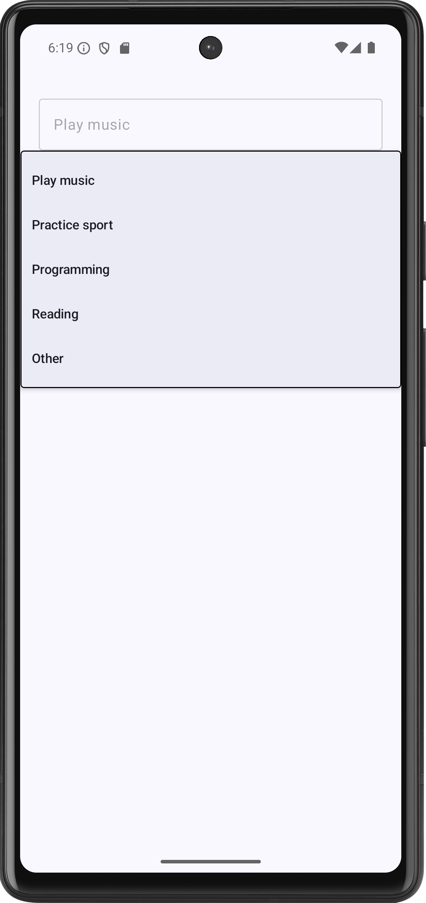

# Android App with component DropdownMenu
## Android Studio Version
Android Studio Koala 2024.1.1

## Language
Kotlin with JetPack Compose

## Purpose
This app is a demo showing the component **DropdownMenu**

## The expected result is:

## Source code:
The source code of the app can be found [here](app/src/main/java/com/example/componentdropdownmenu/MainActivity.kt)
